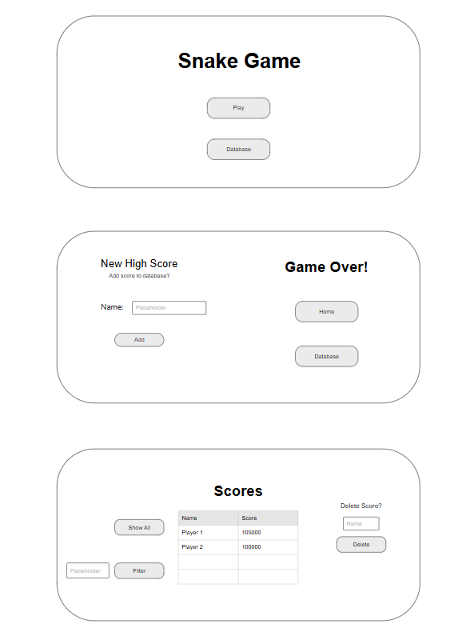

# Web Dev Starter Code

## Project Spec

### What is the general theme?
  * Online Snake game clone with player leaderboard.
### What is it going to do?
  * The player will be able to play the snake game in the browser and have the option to
    save their score to the database with a nickname. The option appears once the game is
    over, so players don’t have to input a new nickname each time and can save their best
    score under any name not currently in use. Players can also look over the database
    themselves, with the option to load all scores (sorted with the top scores first) or
    search by name. Players can also delete entries in the database by name (in a full-fledged
    game, players would not be able to delete other players scores from the database, but we’ll
    just assume all players are kind enough to not do so). The main menu screen, the game, and
    the database will all be on separate pages, with the Game Over screen acting as a popup
    for when the game ends.  When the game is over, players can enter a name and the score
    will be added before both elements are added to the database. If the player does not want
    to save their score, they can use the home button to navigate back to the main screen to
    play again or look at the leaderboard/database. From the leaderboard, players also have
    the option to return to the main screen to play the game. On the game play page, players
    will be able to use the arrow keys or WASD to move around on screen. Items will appear
    randomly that, when collected by the player, will increase their score and the length of
    the snake. 
### Who is the target audience?
  * General public/ young adults / teens 
### What sort of data will it manage?
  * Names assigned to scores. Scores will be generated separately while playing the game, but
    they only get saved to the database when a player attaches a name to the score. Like the
    original snake game, players will be able to collect items to increase their score. When an
    item is collected, their tail grows, making the game arena more difficult to navigate
    through without colliding with the walls or the snake’s own body. The score will be updated
    each time the player collects an item and displayed on the screen. This value will be kept
    until a new game is started, so as to allow players a chance to save their score to the
    leaderboard. Else, no entry is submitted to the database and the score is reset to 0 when
    the next game starts. Names will be the only element the player submits via user input,
    since the scores are saved separately.
### Stretch Goals?
  * I’d love to add some sound effects and/or transition animates between the different pages.
    If I have time, it would also be nice to create some custom sprites for the game to give it
    some extra polish. Ideally, I could also create a system where the browser can recognize
    which name belongs to the current player, so players can only delete their own scores from
    the leaderboard, but I’m not quite sure how I’d go about accomplishing that.

## Project Wireframe

